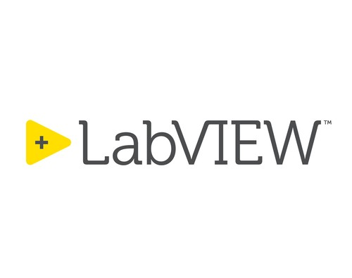

<h1 align="center">Hi 👋, I'm Chen Pyng Haw</h1>
<h3 align="center">A passionate Data Engineering student from UTM</h3>

- 🎓 A third-year Computer Science (Data Engineering) student at UTM  
- 📍 Born and raised in Selayang, Selangor, Malaysia
- 🌱 Currently diving into **Web development** to build my personal portfolio site.
- ⚡ Fun fact: I debug better than I joke 😅
- 📫 How to reach me: **pynghaw5@gmail.com**

<h3 align="left">🛠️ Recent Projects</h3>

- ✏️ <a href= "https://github.com/pynghaw/digit-recognizer">**Handwritten Digit Recognizer** (TensorFlow.js + React)</a> 
  A web-based digit recognition app powered by a trained TensorFlow CNN model, running entirely in-browser via TensorFlow.js and deployed with a clean React interface.  
  🔗 [Try it here](https://digit-recognizer-eta.vercel.app/)

- 📊 <a href= "https://github.com/pynghaw/Simple-Filterable-Table">**SimpleFilterableTable** (Next.js + FastAPI)</a> 
  A simple full-stack web app that displays filterable table data with server-side processing. The frontend is built using Next.js while the backend is powered by FastAPI.

<h3 align="left">🧑‍🤝‍🧑Connect with me:</h3>

<h3 align="left">⚙💻Languages:</h3>

  
  
  
  
  
  
  
  

|  |  |
|:--:|:--:|

